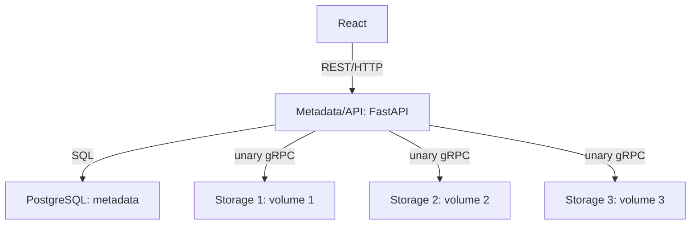

# Kiến trúc triển khai V1 — Distributed File Storage

**Ngày chốt:** 02/10/2026 · **Một người code** · **Trạng thái:** đặc tả trước triển khai.

Tài liệu này cụ thể hóa `PROJECT_OVERVIEW.md`. Các con số giới hạn là lựa chọn của dự án, không phải giới hạn của Python hay gRPC. API và wire format nằm trong `API_CONTRACTS.md` và `storage.proto`.

## 1. Quyết định đã chốt

| Vấn đề | Quyết định V1 |
|---|---|
| Kiến trúc | React → REST/HTTP → Metadata/API → unary gRPC → Storage Nodes |
| Backend | Python 3.12, FastAPI, SQLAlchemy, Alembic, PostgreSQL |
| Metadata | Một process hoạt động; một Uvicorn worker; không có HA |
| Storage | Một codebase Python chạy thành ba process, mỗi node một volume riêng |
| File | Immutable; upload, list, detail, download, delete |
| Chunk | Mặc định 2 MiB; SHA-256 cho chunk và toàn file |
| Replication | Mặc định RF=2; hai node khác nhau, ưu tiên khác failure domain |
| Phát hiện lỗi | Metadata chủ động gọi `HealthCheck`, không thêm heartbeat server |
| Repair | Bấm tay; Metadata đọc source rồi ghi destination; không thêm RPC replicate |
| Dữ liệu file | Đi qua Metadata; upload xử lý từng chunk; download dựng tempfile trước |
| Triển khai | Compose một máy để dev; hai Compose trên hai máy để demo |
| Thứ tự làm | Backend hoạt động từ đầu đến cuối trước, UI sau |

Không thêm gateway, queue, Redis, Kafka, Kubernetes, gRPC-Web, streaming RPC, metadata replication hoặc auth vào V1. Phạm vi này giữ nguyên dù hiện chỉ một người triển khai.

## 2. Thành phần và cách chạy



Metadata nhận file, chọn placement, giữ metadata và điều phối các thao tác. PostgreSQL không chứa bytes của chunk. Storage không biết một file có những chunk nào và không chọn node khác. Storage chỉ phục vụ bốn RPC trong proto.

V1 dùng code Python đồng bộ cho thao tác DB, filesystem và gRPC. FastAPI chạy thao tác blocking trong threadpool; không gọi gRPC đồng bộ trực tiếp trong event loop. Mỗi thao tác/thread có SQLAlchemy Session riêng; không chia sẻ Session giữa background worker và request.

Một background loop trong Metadata thực hiện health polling và cleanup. Khởi tạo/dừng loop theo lifespan của ứng dụng, không chạy ở thời điểm import. Storage dùng gRPC server với threadpool nhỏ và một mutex bảo vệ Store/Delete/đọc snapshot của chunk. Health không được đợi mutex của toàn bộ transfer; có thể trả thống kê đã cache. Không tạo một service mới cho từng loại công việc.

### Giới hạn đồng thời có chủ đích

Một `operation_lock` trong Metadata tuần tự hóa: upload, chuẩn bị download, delete, repair và cleanup. Request không lấy được lock trả `409 OPERATION_BUSY`; background cleanup bỏ lượt và thử ở vòng sau. Đây là giới hạn cho demo, không phải thuật toán distributed locking.

Lock được giữ đến khi DB và tác vụ RPC của thao tác kết thúc. Download nhả lock sau khi tempfile đã hoàn chỉnh, trước khi gửi HTTP file. List/detail/node status vẫn đọc được trong lúc xử lý. Health polling chỉ cập nhật trạng thái node, không xóa hoặc sửa replica rows. Các thay đổi trạng thái replica từ RPC xảy ra dưới operation lock.

Không chạy nhiều Uvicorn worker hoặc nhiều Metadata instance: lock trong process không bảo vệ được chúng. Không giữ DB transaction mở khi đang chờ RPC. Dùng transaction ngắn trước/sau RPC và trạng thái trung gian bền vững.

## 3. Cấu hình mặc định

| Cấu hình | Mặc định | Quy tắc |
|---|---:|---|
| `CHUNK_SIZE_BYTES` | 2097152 | 256 KiB đến 4 MiB |
| `REPLICATION_FACTOR` | 2 | 1 đến số node cấu hình; demo chuẩn luôn dùng 2 |
| `MAX_FILE_SIZE_BYTES` | 67108864 | 64 MiB cho demo; kiểm tra bằng số bytes thật |
| `GRPC_MAX_MESSAGE_BYTES` | 8388608 | Cấu hình send/receive ở cả client và server |
| `HEALTH_INTERVAL_SECONDS` | 3 | Poll các node độc lập, timeout không cộng dồn toàn cluster |
| `HEALTH_RPC_TIMEOUT_SECONDS` | 1 | Không retry health trong cùng một lượt |
| `NODE_DOWN_AFTER_SECONDS` | 10 | Kể từ health thành công cuối cùng |
| `CHUNK_RPC_TIMEOUT_SECONDS` | 5 | Mỗi lần Store/Get/Delete |
| `RPC_MAX_ATTEMPTS` | 2 | Gồm lần đầu; chỉ retry lỗi transient |
| `CLEANUP_INTERVAL_SECONDS` | 5 | Chỉ cleanup khi operation lock trống |
| `REPAIR_MAX_CHUNKS` | 8 | Một lượt repair nhỏ, có thể bấm nhiều lượt |
| `REPAIR_TIME_BUDGET_SECONDS` | 30 | Ngừng bắt đầu chunk mới khi hết budget |
| `VITE_API_BASE_URL` | `/api/v1` | Frontend proxy dev; cấu hình URL khi cần |

MiB = 1,048,576 bytes. File rỗng được hỗ trợ, có 0 chunk và checksum của chuỗi bytes rỗng. Không tạo chunk rỗng cuối file. Chunk cuối có thể nhỏ hơn chunk size.

Các limit được validate khi khởi động. Mọi interval/deadline/time budget phải hữu hạn và dương; không nhận inf/nan. Chunk size thay đổi chỉ áp dụng cho file mới; file cũ giữ chunk size và mapping cũ. RF được snapshot vào từng file; repair dùng RF của file đó. HTTP/proxy timeout cho upload/download tối thiểu 300 giây ở cấu hình demo; RPC timeout vẫn hữu hạn. Không gọi các giá trị này là SLA.

Node registry đọc từ biến `STORAGE_NODES_JSON` của Metadata:

```json
[
  {"node_id":"node-1","host":"storage-node-1","port":50051,"failure_domain":"dev_host"},
  {"node_id":"node-2","host":"storage-node-2","port":50052,"failure_domain":"dev_host"},
  {"node_id":"node-3","host":"storage-node-3","port":50053,"failure_domain":"dev_host"}
]
```

Startup upsert host/port/domain vào DB nhưng không xóa mapping của node vắng cấu hình. Node vắng cấu hình được đánh dấu `enabled=false`, không được placement/repair chọn; file replicas vẫn giữ để xem và cleanup sau khi re-enable. Không đổi `node_id` hoặc `failure_domain` của node đã chứa dữ liệu khi vận hành V1; đổi domain là thay topology cần kiểm tra lại. Health response phải khớp node_id/domain đã cấu hình, sai thì node DOWN, `IDENTITY_MISMATCH`.

Storage env: `NODE_ID`, `FAILURE_DOMAIN`, `GRPC_BIND_HOST=0.0.0.0`, `GRPC_PORT`, `DATA_DIR=/data/chunks`, chunk/message limit. Địa chỉ bind khác địa chỉ Metadata kết nối. Không hard-code localhost trong logic.

## 4. Mô hình metadata

Mọi ID file/chunk là UUID do Metadata sinh. node_id là chuỗi ổn định trong config. Timestamp lưu UTC. Các state là PostgreSQL CHECK constraint hoặc enum; chọn một cách nhất quán trong migration.

| Bảng | Fields chính | Ràng buộc |
|---|---|---|
| `files` | id, original_name, content_type, size_bytes, chunk_size_bytes, total_chunks, replication_factor, checksum_sha256 nullable lúc upload, status, error_code nullable, created_at, deleted_at nullable | size >=0, RF>=1; tên file không unique |
| `chunks` | id, file_id, chunk_index, size_bytes, checksum_sha256 | FK files; UNIQUE(file_id, chunk_index); index>=0; size>0 |
| `chunk_replicas` | chunk_id, node_id, status, cleanup_pending, last_verified_at nullable, last_error nullable | PK(chunk_id,node_id); FK chunks/nodes |
| `storage_nodes` | node_id, host, port, failure_domain, enabled, status, last_success_at nullable, last_error nullable, capacity_bytes, available_bytes, used_bytes | node_id unique; port 1..65535; bytes>=0 |

File states:

- `UPLOADING`: chưa public để download.
- `AVAILABLE`: upload đã commit; không có nghĩa mọi replica đang truy cập được.
- `FAILED`: upload không hoàn tất; chỉ xem thông tin lỗi, cleanup chạy tiếp.
- `DELETING`: đã xóa logic, chờ cleanup các replica.
- `DELETED`: cleanup đã xác nhận hoàn tất; giữ tombstone, ẩn khỏi list mặc định.

Replica states: `PENDING` (đã dự định ghi nhưng chưa có ack xác nhận), `VERIFIED` (lần kiểm tra gần nhất đúng), `MISSING` (Get báo không tồn tại), `CORRUPTED` (bytes/checksum không đúng), `DELETED` (Delete đã xác nhận). `cleanup_pending` độc lập với status.

Node states: `ACTIVE`, `SUSPECTED`, `DOWN`. Sau restart Metadata, reset các node thành DOWN cho đến health thành công. Replica VERIFIED giữ nghĩa "đã xác minh lần cuối", không là bảo đảm bytes còn tồn tại mãi.

Trạng thái chunk dùng cho UI được **suy ra**, không thêm cột state trùng lặp:

- file UPLOADING: `PENDING`;
- có >=RF replica VERIFIED trên node ACTIVE: `AVAILABLE`;
- có 1..RF-1: `UNDER_REPLICATED`;
- không có replica đủ điều kiện: `UNAVAILABLE` (không gọi LOST khi node có thể chỉ mất mạng).

UI hiển thị `known_readable`, replica count và domain count là thông tin ước tính theo metadata/health. Chỉ tính replica VERIFIED trên node enabled ACTIVE và không cleanup_pending. Download và repair vẫn xác minh bytes. `domain_degraded=true` khi số domain trong các replica được tính < min(RF, số domain của các node enabled), kể cả còn đủ RF trong một máy. `over_replicated=true` khi live_replica_count > RF. Health không chứng minh mọi chunk trên node còn nguyên. Chunk của FAILED/DELETING hiển thị INACTIVE.

Không cascade xóa metadata của DELETING/FAILED trước khi cleanup kết thúc. Không xóa node row đang được replica tham chiếu. Không có GC tombstone tự động trong V1.

## 5. Placement

Thuật toán greedy đơn giản, không cần consistent hashing:

1. Lấy các node enabled, ACTIVE, writable và có available_bytes >= chunk size. Free space chỉ là snapshot, Store vẫn có thể báo đầy.
2. Loại node đã có replica hợp lệ của chunk; giữ các domain đã dùng.
3. Nếu còn node ở domain chưa dùng, chỉ xét nhóm đó trước.
4. Trong nhóm, chọn `(allocated_bytes_this_operation, used_bytes, node_id)` nhỏ nhất; tăng allocated bytes sau mỗi placement thành công.
5. Lặp đến RF; mỗi chunk tối đa một replica/node. Nếu không đủ domain, có thể chọn hai node cùng domain và ghi cảnh báo; nếu không đủ node thì upload thất bại.

Không retry vô hạn và không tiếp tục tin node ACTIVE nếu RPC vừa thất bại. Tạm loại node đó khỏi lựa chọn của thao tác hiện tại. Khi response timeout, outcome là chưa biết, không mặc định coi bytes chưa được ghi.

Local một host: cả ba node dùng `dev_host`, chỉ chứng minh chịu lỗi process. Demo: node-1 ở A; node-2/3 ở B. RF=2 và cả hai máy hoạt động thì mỗi chunk có một replica ở A, một ở B. Node-1 vì vậy chứa toàn bộ dữ liệu logic; dung lượng dùng không cân bằng là hệ quả của topology, không hứa tăng capacity tuyến tính trong demo hai máy.

Repair dùng cùng quy tắc chọn destination. Replica trên node DOWN không tính là live nhưng vẫn giữ mapping. Sau khi node trở lại có thể có >RF replica đã ghi; V1 không tự prune/rebalance chúng và báo `OVER_REPLICATED`. Không copy thêm chỉ để đổi domain nếu đã đủ RF: đó là rebalancing ngoài scope.

## 6. Upload và điểm commit

1. HTTP nhận một multipart file bằng `UploadFile`; không gọi `read()` không giới hạn. Kiểm tra tên và size thật của spool; file trên limit trả 413 trước khi ghi chunk.
2. Lấy operation lock. Nếu cluster không đủ node cho RF, trả 503; chưa tạo file AVAILABLE. File rỗng không cần storage node.
3. Tạo file UPLOADING, snapshot chunk size/RF. Đọc spool từng chunk, hash toàn file đồng thời, không giữ cả file trong RAM.
4. Với mỗi chunk, tạo row chunk và replica PENDING **trước** StoreChunk. RPC có timeout và retry idempotent cùng chunk_id/payload.
5. Ack phải khớp id, size và checksum. Sau ack hợp lệ mới chuyển replica VERIFIED. RPC lỗi: chọn node khác nếu có; mọi mapping đã thử vẫn giữ để cleanup/reconcile.
6. Khi tất cả chunk có RF replica đã xác nhận, transaction cuối cập nhật checksum/size/count và file AVAILABLE. Chỉ lúc này REST trả 201.
7. Failure/cancel trước commit: chuyển FAILED, đặt cleanup_pending cho tất cả replica đã thử, trả lỗi có file_id nếu đã tạo. Không trả thành công chỉ vì browser gửi đủ bytes.

Nếu client mất response sau commit, file có thể đã AVAILABLE; người dùng kiểm tra list trước khi upload lại. POST upload không idempotent: lần mới tạo file_id mới, kể cả cùng tên. V1 không có resumable upload, dedup hoặc client idempotency key.

Store trên node: validate UUID và SHA-256(data), ghi tempfile trong cùng filesystem, flush + fsync, atomic replace dưới mutex, trả ack sau khi file đã commit. Kiểm tra RPC context còn active sau khi lấy mutex và ngay trước commit; request đã timeout/cancel không được ghi trễ sau cleanup. Delete và commit được tuần tự hóa bởi cùng mutex. Chỉ dùng chunk_id đã validate để tạo path; original_name không được dùng làm path lưu chunk. V1 bảo vệ trước process crash, không tuyên bố durability trước mọi dạng mất điện/phần cứng.

Store lại cùng ID và cùng bytes/hash trả success `already_existed=true`. ID đã chứa bytes khác trả ALREADY_EXISTS; không overwrite file immutable. SHA đúng được kiểm tra từ bytes, không tin field của client. Tempfile chưa commit không được Get trả về; startup node xóa tempfiles cũ sau khi process trước đã dừng.

## 7. Download và fallback

V1 dựng file vào tempfile của Metadata **trước khi gửi HTTP 200**. Đây là lựa chọn để khi chunk cuối không đọc được vẫn trả JSON 503 rõ ràng, thay vì đã gửi HTTP headers rồi lỗi giữa luồng.

1. Lấy operation lock, kiểm tra file AVAILABLE, snapshot mapping theo chunk_index.
2. Lần lượt Get mỗi chunk. Ưu tiên node ACTIVE, sau đó SUSPECTED; có thể thử node DOWN enabled như fallback cuối nếu không còn lựa chọn. Không tải song song nhiều chunk trong V1.
3. Xác minh chunk_id, số bytes, SHA-256(data) và checksum metadata. Get của replica PENDING có thể xác nhận lại và chuyển VERIFIED nếu đúng.
4. Timeout/unreachable: thử replica khác, không ghi MISSING. NOT_FOUND: ghi MISSING. Checksum sai: CORRUPTED. Hết replica: xóa tempfile, trả 503 với chunk_index.
5. Ghi chunk theo thứ tự, kiểm tra full-file checksum/size. Hoàn tất thì nhả lock và trả file HTTP với Content-Length và Content-Disposition an toàn.
6. Xóa tempfile sau response hoàn tất hoặc client ngắt. Thư mục download tmp được dọn lúc startup Metadata, không dùng làm storage chính.

HTTP file response có thể truyền dần từ tempfile; việc này không thay unary gRPC. Progress download chỉ bắt đầu tăng khi đã dựng file xong. UI có thể hiện "Đang chuẩn bị file" trước đó; không vẽ phần trăm xử lý server giả.

Disk tạm của Metadata cần đủ cho multipart spool và tempfile. RAM vẫn O(chunk size), có thêm overhead protobuf; không tuyên bố chính xác 2 MiB RAM. Khi Metadata đang gửi tempfile đã hoàn chỉnh, delete file gốc có thể thực hiện và không ảnh hưởng snapshot download đó.

## 8. Health, repair, recovery

### Health polling

Metadata gọi HealthCheck mỗi 3 giây/node, deadline 1 giây. Lượt health thất bại đầu: SUSPECTED; quá 10 giây kể từ lần thành công cuối: DOWN. Node chưa từng có health thành công là DOWN. Một health đúng identity và writable=true chuyển ACTIVE; writable=false chuyển DOWN kèm lý do. Node writable=false vẫn có thể được thử Get fallback nhưng không được placement chọn.

Theo dõi tuổi health bằng monotonic clock trong process; lưu last_success_at UTC để hiển thị. Không dùng đồng hồ do node gửi để quyết định timeout. Node DOWN có thể là network partition; detector không chứng minh máy vật lý đã chết.

Readiness yêu cầu health scheduler và data RPC client còn running, cùng DB ping,
startup recovery và khởi tạo download temp directory/dọn stale temp thành công.
Scheduler/client lỗi hoặc dừng thì ready trả 503; live và GET nodes/cluster,
files/list/detail/chunks vẫn cho quan sát
snapshot nếu DB dùng được. Health RPC thất bại của một node không làm scheduler
dừng hoặc khiến Metadata mất readiness.

### Manual repair

Một REST request repair xử lý tối đa 8 chunk, ngừng bắt đầu chunk mới khi quá budget 30 giây. Không có job queue. UI cho bấm lại và hiển thị remaining. Một chunk đang xử lý được hoàn tất với các RPC deadline, nên lượt có thể vượt budget thêm thời gian một chunk.

Lượt repair chọn theo `(file_id, chunk_index)` tăng dần với cursor; xem filter/cursor trong API_CONTRACTS. Với mỗi chunk thuộc file AVAILABLE, probe các replica known trên node ACTIVE/SUSPECTED bằng Get và validate checksum; không chỉ đếm cached VERIFIED. Báo UNAVAILABLE nếu không tìm được source, không chế tạo dữ liệu mới.

Nếu thiếu live RF, Metadata giữ một source đúng, chọn destination, tạo/upsert PENDING trước Store, xác nhận rồi chuyển VERIFIED. Chỉ copy số replica cần thiếu, không copy toàn file. Source/destination đều đi qua Metadata, không node-to-node RPC. Có thể phục hồi MISSING tại cùng node bằng Store. Với CORRUPTED, chỉ Delete replica lỗi rồi Store lại khi đã có source khác được xác minh; Store không tự ghi đè bytes lỗi.

Lượt trả `checked_chunks`, `repaired_replicas`, `remaining_chunks`, `next_after`
và `results` theo từng chunk; mỗi result có outcome HEALTHY/REPAIRED/
NO_DESTINATION/UNAVAILABLE/ERROR. Không có aggregate fields riêng cho từng
outcome; UI có thể tổng hợp từ results đã nhận. Không báo repaired khi chỉ gửi
request. Failed attempts có mapping để retry ở lượt sau. Không repair file
FAILED/DELETING/DELETED. Cleanup của delete có ưu tiên trước repair. Không có
background repair V1; cleanup background vẫn bắt buộc.

Cleanup ưu tiên là một pass tối đa 8 replica dưới cùng operation lock trước
scan; budget monotonic tính cả pass này. Nếu chưa bắt đầu chunk nào vì hết
budget, giữ cursor đầu vào và remaining chưa quét theo API_CONTRACTS. Đếm live
RF repair từ các Get/Store xác nhận trong lượt và node ACTIVE; không dùng cached
VERIFIED bị timeout làm bằng chứng source. Đủ RF nhưng thiếu domain chỉ báo
degraded, không tự thêm replica. Trước Delete corrupted replica, commit mapping
PENDING; Storage Delete kiểm tra RPC còn active sau lấy mutex và trước unlink,
để request đã hết hạn không xóa trễ khi lượt repair sau ghi lại chunk.

### Khi node hoặc Metadata khởi động lại

- Node giữ node_id và volume; restart không đổi data path.
- Health thành công cho thấy node reachable, chưa chứng minh chunk cũ còn nguyên. Download xác minh lúc đọc; chạy manual repair scoped theo node để kiểm tra lại các mapping khi cần. Đây là reconcile **các replica đã biết**, không inventory scan hoặc tìm orphan tùy ý.
- Replica cũ trở lại có thể làm dư RF; giữ nguyên, không tự xóa.
- Startup Metadata dưới operation lock: file UPLOADING → FAILED và enqueue cleanup các attempted replicas; file DELETING tiếp tục cleanup; PENDING của AVAILABLE để repair/Get xác minh. Không resume upload tự động.
- PostgreSQL phải giữ volume; mất metadata DB không được giải quyết bằng cách quét storage trong V1.

## 9. Delete và cleanup bền vững

DELETE lấy operation lock, đánh dấu file DELETING và cleanup_pending=true trên
mọi attempted replica chưa DELETED trong một transaction **trước** RPC. Replica
đã được xác nhận DELETED giữ nguyên. File biến mất khỏi list mặc định và không
thể download/repair ngay từ commit này.

Thử Delete các node reachable. RPC idempotent: chunk không tồn tại vẫn là success. Node DOWN/timeout giữ pending. Background worker mỗi 5 giây tiếp tục pending cleanup khi lock trống, kể cả sau Metadata restart. Mỗi lượt tối đa 8 replica; retry qua các lượt không có hạn số lượt, nhưng từng RPC và từng lượt có giới hạn.

Node đã nhận Store nhưng response bị mất vẫn có PENDING row, nên Delete phải gửi tới mọi attempted replica. Không bỏ row chỉ vì Store báo timeout. FAILED cũng dùng cleanup này nhưng vẫn giữ trạng thái FAILED để người dùng đọc nguyên nhân.

Khi mọi replica DELETED, file DELETING → DELETED. Giữ tombstone và rows V1. File bị delete không xuất hiện lại khi node trở lại. Nếu node bị tháo vĩnh viễn, cleanup có thể chờ vô hạn; không báo đã xóa vật lý hoàn tất và không giả lập ack. Không có distributed transaction với filesystem.

## 10. Triển khai hai máy

| Thành phần | Dev local | Máy A demo | Máy B demo |
|---|---|---|---|
| React, Metadata, PostgreSQL | Local | Có | Không |
| node-1 | Local, dev_host | machine_A | Không |
| node-2/3 | Local, dev_host | Không | machine_B |

Compose dự kiến: `compose.local.yml`, `compose.machine-a.yml`, `compose.machine-b.yml`; dùng cùng image/build context. Compose trên A không tự khởi động container ở B. Các file Compose và README lệnh chạy được viết/kiểm tra khi code, không giả định đã có ở bộ đặc tả này.

Trong demo, Metadata trên A có thể gọi node-1 qua tên service Docker; node-2/3 dùng LAN IP của B với port 50052/50053 đã publish. PostgreSQL không cần publish ra LAN. Frontend chỉ gọi REST port 8000 của A. Giữ node_id nhất quán giữa Metadata config và Storage env.

Hai máy cùng LAN/hotspot, cho phép inbound RPC port trên B, kiểm tra Wi-Fi không chặn client-to-client. Nếu chạy native, bind 0.0.0.0 để máy khác kết nối. Không dùng localhost của A để trỏ sang B. HTTP/gRPC plaintext chỉ dùng LAN demo tin cậy; không triển khai public Internet như một sản phẩm có auth.

**Phạm vi chịu lỗi:** tắt B vẫn đọc được file có mọi chunk còn bản sao trên A; lúc đó chỉ còn node-1, không thể restore RF=2. Tắt A làm Metadata và PostgreSQL mất nên toàn bộ API ngừng, kể cả B còn bytes. Hai máy không đồng nghĩa toàn hệ thống có HA.

Demo repair khi tắt node-2 nhưng node-3 vẫn ở B: copy bản thiếu từ node-1 sang node-3 và đạt RF=2 khác domain. Demo host failure và demo repair là hai tình huống riêng, không hứa repair đủ RF khi chỉ còn một node.

## 11. Failure matrix

| Tình huống | Hành vi bắt buộc |
|---|---|
| Store timeout sau khi node đã ghi | Retry cùng ID; giữ mapping trước RPC; không đoán outcome |
| Upload không đạt RF | FAILED; cleanup; không public file |
| Một replica mất/corrupt | Get fallback; ghi trạng thái lỗi tương ứng |
| Mọi replica của chunk không đọc được | 503 trước khi gửi HTTP file; không trả file thiếu |
| Node tắt trong Delete | File ẩn ngay; cleanup pending qua restart |
| Node quay lại với volume trống | Health có thể ACTIVE; Get/repair phát hiện MISSING và phục hồi từ source |
| B tắt toàn bộ | Đọc từ A khi có replica; báo under-replicated, repair no_destination |
| Metadata/PostgreSQL tắt | API unavailable; không có failover metadata |
| Không đủ disk trên node | RESOURCE_EXHAUSTED; thử destination khác; upload fail nếu thiếu RF |
| Metadata crash trước upload commit | UPLOADING thành FAILED lúc restart; cleanup attempted replicas |
| Metadata crash sau commit trước response | File AVAILABLE vẫn tồn tại; client xem list |
| Delete/repair trùng nhau | Operation lock, một request trả 409; không hồi sinh file bị xóa |

## 12. Những giới hạn phải nói đúng

Node status và replica availability là quan sát theo thời gian, không là bảo đảm tuyệt đối. Checksum phát hiện bytes không đúng, không phải cơ chế xác thực chống kẻ tấn công. Có replication ở data plane nhưng coordinator/DB/data path tập trung. Manual repair và operation lock giới hạn throughput nhưng đủ chứng minh nguyên lý. File limit, staging disk và unbalanced topology được chấp nhận V1.

Không dùng số lượng service hoặc container để thay cho bằng chứng phân tán. Bằng chứng là: volumes độc lập, RPC qua mạng, replica placement, partial failure, checksum và repair chạy thật.

## 13. Tham chiếu kỹ thuật

- [gRPC Python basics](https://grpc.io/docs/languages/python/basics/): định nghĩa proto và sinh stub.
- [gRPC deadlines](https://grpc.io/docs/guides/deadlines/): RPC timeout phải thiết lập rõ.
- [gRPC status codes](https://grpc.io/docs/guides/status-codes/): lỗi chuẩn và outcome chưa biết khi timeout.
- [FastAPI request files](https://fastapi.tiangolo.com/tutorial/request-files/): UploadFile với spool/file-like interface.

Các nguồn xác nhận cách dùng công cụ; placement, trạng thái DB và giới hạn demo là thiết kế riêng của dự án.
